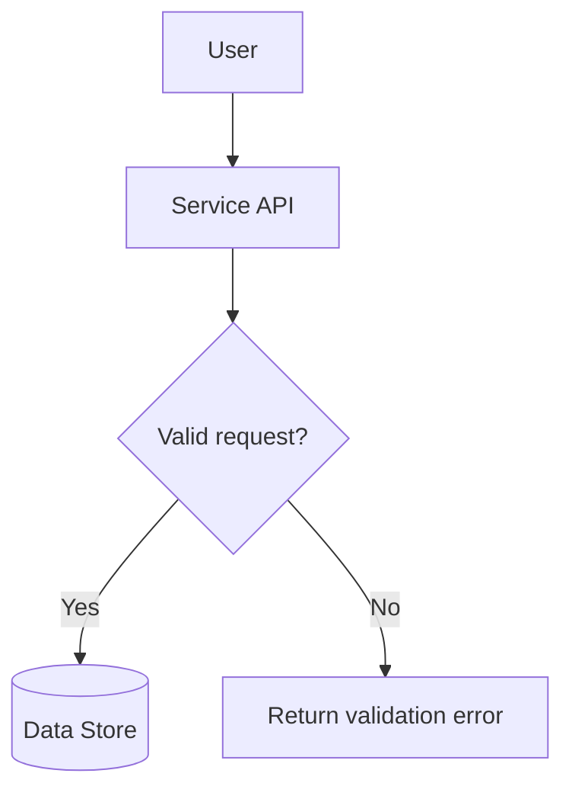
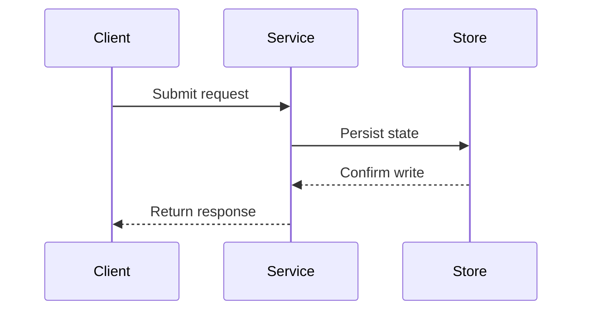

# Design Diagrams

## When To Use Diagrams

Use Mermaid diagrams when they clarify behavior better than prose:

- User journeys.
- API request flows.
- Service-to-service interactions.
- Async event or queue processing.
- State transitions.
- Failure and retry paths.
- Data lifecycle flows.

Keep simple ideas in prose. A diagram should answer a concrete question.

## Where Diagrams Go

Use `flows/001_xxx.md` for diagrams that need more than a short inline summary. Link important diagrams from `design_plan.md`, `hld.md`, or the relevant LLD.

## Confluence Compatibility

Assume Confluence may preserve Mermaid as a fenced code block instead of rendering it as a diagram. Every Mermaid diagram must have a nearby fallback summary that communicates the same design intent.

Use one of these fallback forms:

- A short prose summary before or after the diagram.
- A simple table listing actors, steps, inputs, outputs, and failure behavior.
- A numbered list of the flow steps.

Do not rely on Mermaid-only labels to carry critical requirements, service boundaries, failure modes, or confirmed decisions.

## Flowchart Template

Summary:

- The client calls the service API.
- The service validates the request.
- Valid requests are persisted.
- Invalid requests return a validation error.

## Sequence Template

Summary:

| Step | Actor   | Action                       |
| ---- | ------- | ---------------------------- |
| 1    | Client  | Submits the request.         |
| 2    | Service | Persists state in the store. |
| 3    | Store   | Confirms the write.          |
| 4    | Service | Returns the response.        |

## Diagram Rules

- Name actors and systems with domain terms from `context.md`.
- Show boundaries between this service and other services.
- Include failure or retry paths when they affect design choices.
- Keep diagrams readable; split large diagrams into separate flow documents.
- Do not let a diagram imply an unconfirmed architecture decision. Label proposed flows as proposed until approved.
- Keep Mermaid in fenced `mermaid` code blocks and avoid custom Markdown extensions around diagrams.
